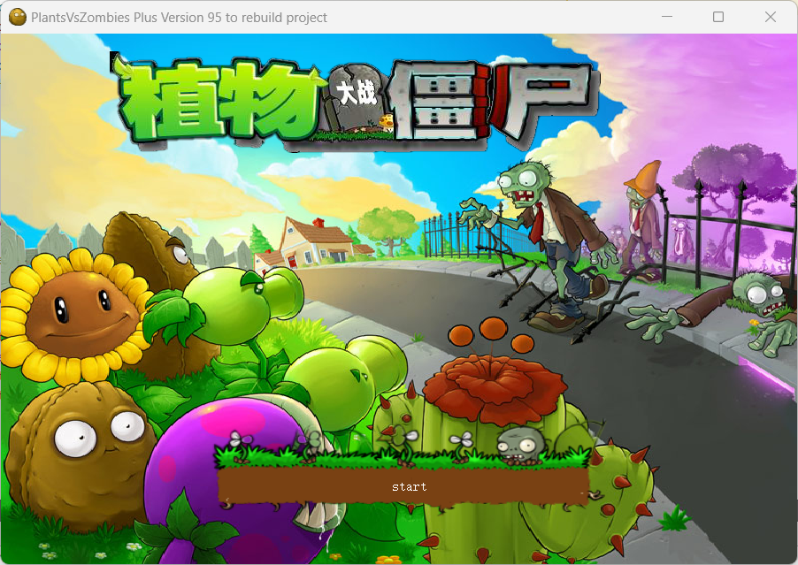
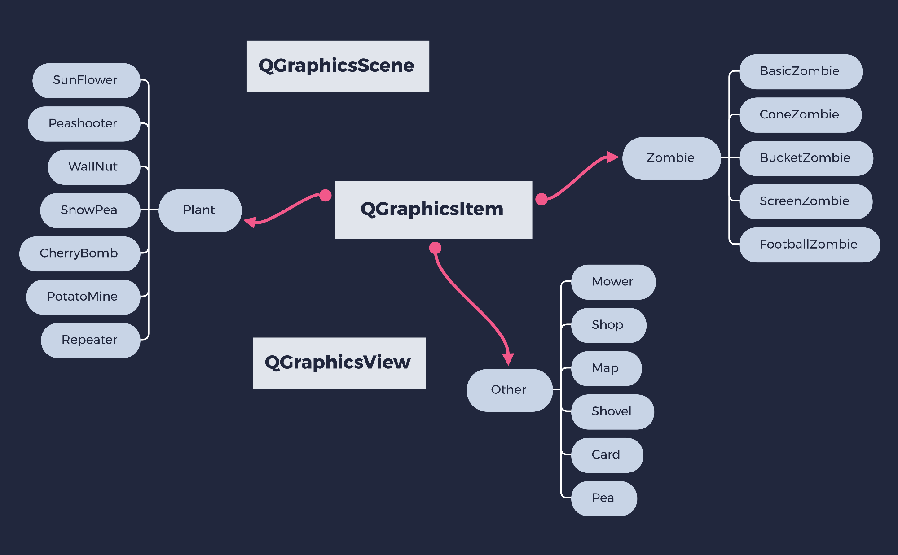
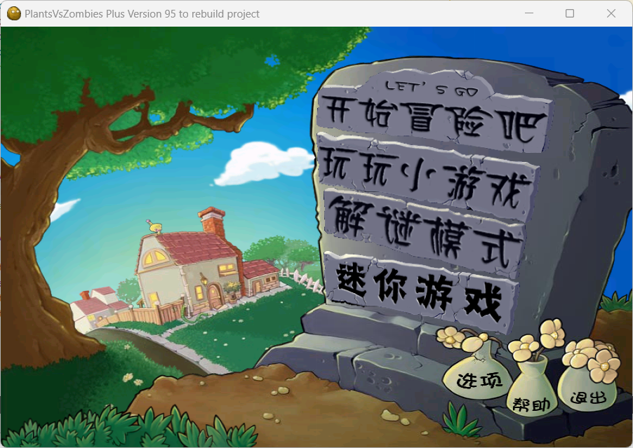
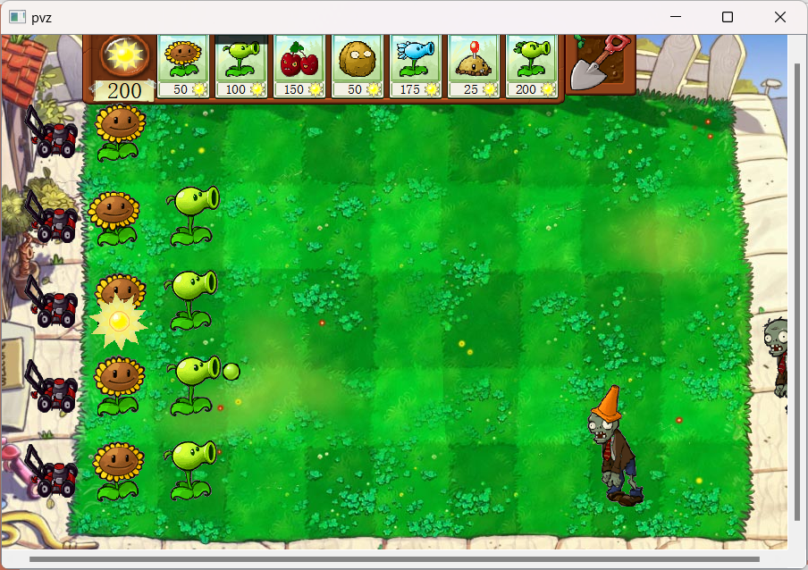

# qt-c-pvz

用 **Qt / C++** 基于 **Qt Graphics View（QGraphicsView / QGraphicsScene / QGraphicsItem）** 复刻一个简化版《植物大战僵尸》（参考 95 版的玩法与素材风格）。

本仓库支持**开放完整源代码**（欢迎 Fork / PR / Issue 交流学习）。

## 1. 项目概览

- **工程类型**：qmake（`pvz.pro`）
- **语言标准**：C++17
- **Qt 模块**：`core` `gui` `widgets` `multimedia`
- **窗口尺寸**：`900 x 600`

界面流程（对应 PPT 中的“工作内容回顾”）：

`MainWindow(进入页面) -> loading(等待页面) -> startpage(主页面) -> game(游戏页面)`

游戏启动页（PPT 截图）：



## 2. 已实现功能

### 2.1 核心玩法

- **卡牌拖拽种植**：从商店卡牌拖拽到草坪网格放置植物（`card` + `Map::dropEvent` + `shop::addPlant`）。
- **铲子拖拽移除植物**：拖拽铲子到格子移除植物（`shovel` + `Map::dropEvent` + `shovel::removePlant`）。
- **阳光系统**：
  - 自动掉落阳光（`shop::advance` -> `scene()->addItem(new sun)`）。
  - 点击阳光收集（`sun::mousePressEvent`，增加 `sunnum`）。
- **割草机**：每行一辆割草机（`game` 构造函数中创建 `Mower`）。
- **游戏失败判定**：僵尸到达屏幕左侧阈值（`x < 150`）显示失败图并停止计时器（`game::check`）。

### 2.2 植物与僵尸（部分）

植物卡牌（见 `card::name`）：

- `SunFlower`（向日葵）
- `Peashooter`（豌豆射手）
- `CherryBomb`（樱桃炸弹）
- `WallNut`（坚果墙）
- `SnowPea`（寒冰射手）
- `PotatoMine`（土豆地雷）
- `Repeater`（双发射手）

僵尸类型（在 `game::addZombie` 中随机生成）：

- `basiczombie`（普通僵尸）
- `ConeZombie`（路障僵尸）
- `BucketZombie`（铁桶僵尸）
- `ScreenZombie`（铁门僵尸）
- `FootballZombie`（橄榄球僵尸）

### 2.3 音效与动画

- **背景音效**：`QSound("Grazy.wav")`（见 `game.cpp`）。
- **动画**：植物/僵尸/阳光等使用 `QMovie` 播放 GIF（见 `plant`/`zombie`/`sun`）。
- **资源管理**：图片与音效通过 `.qrc` 统一打包（`images/imges.qrc`、`sound/sound.qrc`）。

## 3. 技术实现要点（来自 PPT 总结 + 代码结构）

- **Graphics View 架构**：
  - **Scene**：负责管理大量图元（`QGraphicsScene`）。
  - **View**：负责渲染场景与显示背景（`QGraphicsView` + `setBackgroundBrush`）。
  - **Item**：植物/僵尸/子弹/阳光/卡牌等均为 `QGraphicsItem` 派生类，核心在 `boundingRect()` / `paint()` / `advance()` / `collidesWithItem()`。
- **主循环驱动**：用 `QTimer` 每 `33ms` 触发 `scene->advance()`，并在同一节拍中完成刷怪与结束判定（`game.cpp`）。
- **交互实现**：依赖 `QDrag` + `QMimeData` 完成卡牌/铲子拖拽到地图网格的放置与移除（`card.cpp` / `shovel.cpp` / `map.cpp`）。

架构图（PPT 截图）：



## 4. 运行截图（仓库内资源）

- `images/init.png`：进入页面
- `images/StartScreen.jpg`：等待页面
- `images/Surface.png`：主页面
- `images/Background.jpg`：游戏背景

游戏主页面（PPT 截图）：



游戏画面（PPT 截图）：



## 5. 构建与运行

### 5.1 使用 Qt Creator（推荐）

- 用 Qt Creator 打开 `pvz.pro`
- 选择 Kit（MSVC / MinGW / clang 等均可，取决于你本机 Qt 安装）
- 编译并运行

### 5.2 命令行（qmake）

在项目根目录执行（不同平台命令略有区别，以你的 Qt 安装为准）：

```bash
qmake pvz.pro
make
```

Windows（MinGW）常见为：

```bash
qmake pvz.pro
mingw32-make
```

## 6. 项目结构

```text
.
├─ main.cpp                 # 程序入口
├─ pvz.pro                  # qmake 工程文件
├─ Mainwindow.*             # 进入页面（init）
├─ loading.*                # 等待页面（StartScreen）
├─ startpage.*              # 主页面（Surface）
├─ game.*                   # 游戏主逻辑（Scene/View/Timer/刷怪/结束判定）
├─ plant.* / zombie.*       # 植物/僵尸基类
├─ pea.* / peashot.* ...    # 具体植物、子弹等派生类
├─ images/                  # 图片资源 + images/imges.qrc
└─ sound/                   # 音频资源 + sound/sound.qrc
```

## 7. 声明（务必阅读）

- **代码**：本仓库代码用于学习与交流，支持开放完整源代码。
- **素材/音效**：部分素材来源于原版游戏或其他开源项目，版权归原作者所有。
- **非商用**：本项目仅用于个人学习与练习，不用于任何商业用途。
- **侵权联系删除**：如有侵权请联系我，我会及时处理。

## 8. 致谢

- **GeeeekExplorer/PVZ**：https://github.com/GeeeekExplorer/PVZ （学习了其基于 Graphics View 的实现思路）

## 9. 后续计划（来自 PPT 展望）

- 新地图：天台/泳池/黑夜等
- 新模式：排山倒海、敲罐头、植物僵尸、保龄球大战等
- 双人对战模式（植物 vs 僵尸）
- 加入更多原版植物/僵尸

## 10. 贡献方式

- 提 Issue：问题反馈、玩法建议、素材替换建议等
- 提 PR：修复 bug、优化结构、补全功能

---

